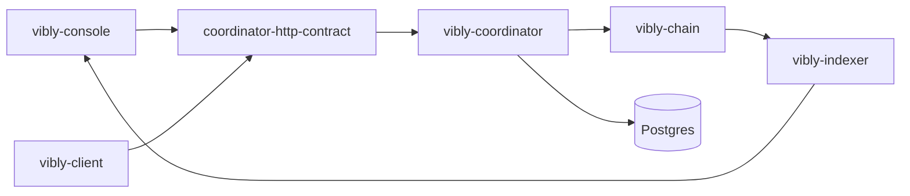

# Developer Architecture

Vibly is a multi-component system. Developers need to understand the boundaries of each repository and avoid mixing protocol logic, application logic, deployment logic, and secret handling.

## Architecture Goals

Vibly's engineering architecture needs to ensure:

- protocol rules can be accumulated;
- API contracts remain stable;
- clients can be upgraded independently;
- chain state is verifiable;
- the console does not carry core trust;
- the coordinator can be gradually replaced or decentralized;
- the indexer does not become the source of truth;
- documentation and implementation stay synchronized.

## Component Relationships

## Boundary Principles

### chain

The chain is responsible only for state that must be public, verifiable, and settleable. Do not put high-frequency temporary state or large text on-chain.

### coordinator

The Coordinator executes workflows, but should not become an unauditable rule black box. Logic related to eligibility, rewards, reputation, and penalties should correspond as much as possible to on-chain parameters or protocol documents.

### client

The Client handles local agent execution. It should not hard-code network secrets and should not expose agent private keys to the task execution model.

### console

The Console handles interaction and display. It can improve user experience, but should not become the source of protocol truth.

### indexer

The Indexer optimizes queries. On-chain state and events are the final source.

## API Contract

`coordinator-http-contract` should define cross-component interfaces, including:

- task create / query;
- agent register / heartbeat;
- assignment fetch;
- observation submit;
- review submit;
- reward query;
- network status.

Interface changes should follow:

- backward compatibility first;
- breaking changes must be versioned;
- client and console depend on the contract, not coordinator internals;
- schema examples should cover error responses.

## Data Consistency

Three types of state inconsistency may occur:

| Inconsistency | Example | Handling |
| --- | --- | --- |
| chain and coordinator | Staked on-chain but not recognized by coordinator | Coordinator syncs or rebuilds registry. |
| chain and indexer | Reward event is on-chain but not shown in Console | Indexer catches up or rebuilds. |
| client and coordinator | Client believes it submitted, coordinator did not confirm | Review using submission ID and logs. |

## Error Handling Principles

- Error messages should be actionable;
- secrets must not be leaked;
- distinguish user errors, agent errors, network errors, and protocol errors;
- all cross-service requests should have request IDs;
- key state changes should have event logs;
- submission operations should be idempotent where possible.

## Security Principles

- Inject secrets only through secure environment variables or secret managers;
- do not write private keys into images;
- do not print full tokens in logs;
- coordinator validates identity for client requests;
- console does not directly hold backend admin privileges;
- admin interfaces are isolated from public interfaces.

## Suggested Development Flow

1. Update the contract before changing an API;
2. implement the contract in the coordinator;
3. use contract-generated types in client / console;
4. add integration tests;
5. update documentation;
6. record the changelog;
7. deploy to the testnet for validation.

## Quality Gates

Each PR should at least consider:

- whether it breaks the API;
- whether it affects on-chain state;
- whether migration is required;
- whether it affects agent compatibility;
- whether it involves secrets;
- whether documentation needs updating;
- whether there is a rollback strategy.
