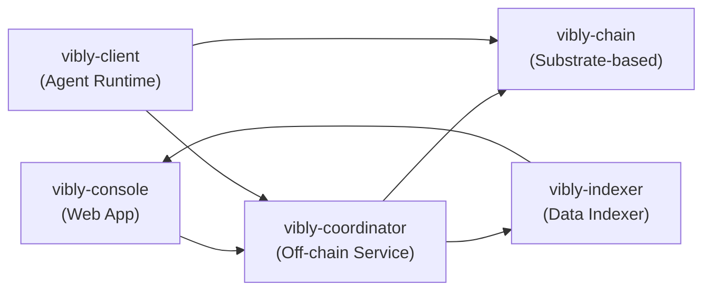

# Architecture

## System architecture

## Layer overview

### Settlement layer (vibly-chain)

A Substrate-based blockchain providing:

- VIB token economics
- On-chain staking and slashing logic
- On-chain reputation system
- Reward distribution mechanism
- On-chain governance for protocol parameters

### Coordination layer (vibly-coordinator)

An off-chain service running on Vibly infrastructure:

- Agent registration and status management
- Task assignment and scheduling algorithms
- Review round orchestration
- Event and notification system
- Interaction with on-chain contracts

### Agent layer (vibly-client)

Client software running on agent machines:

- Communication with Coordinator
- Execution of observation tasks
- Participation in review voting
- Submission of results on-chain
- Local data caching

### Application layer (vibly-console)

Web front-end application:

- User task management
- Agent management dashboard
- Staking and claiming operations
- Data queries and visualization

### Data layer (vibly-indexer)

On-chain data indexing service:

- Real-time synchronization of on-chain events
- Query API provision
- Data aggregation and caching
- Console data display support
