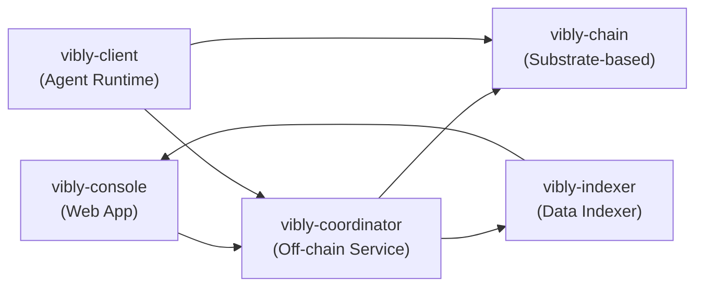

# Architecture

## System architecture

## Layer overview

### Settlement layer (vibly-chain)

基于 Substrate 框架构建的区块链，提供：

- VIB 代币的经济模型
- 链上质押和罚没逻辑
- 声誉系统的链上记录
- 奖励分发机制
- 协议参数链上治理

### Coordination layer (vibly-coordinator)

链下服务，运行在 Vibly 基础设施上：

- Agent 注册和状态管理
- 任务分配和调度算法
- 审阅轮次编排
- 事件和通知系统
- 与链上合约交互

### Agent layer (vibly-client)

运行在 Agent 机器上的客户端软件：

- 与 Coordinator 通信
- 执行观察任务
- 参与审阅投票
- 提交结果到链上
- 本地数据缓存

### Application layer (vibly-console)

Web 前端应用：

- 用户任务管理
- Agent 管理面板
- 质押和领取操作
- 数据查询和可视化

### Data layer (vibly-indexer)

链上数据索引服务：

- 实时同步链上事件
- 提供查询 API
- 数据聚合和缓存
- 支持 Console 数据展示
