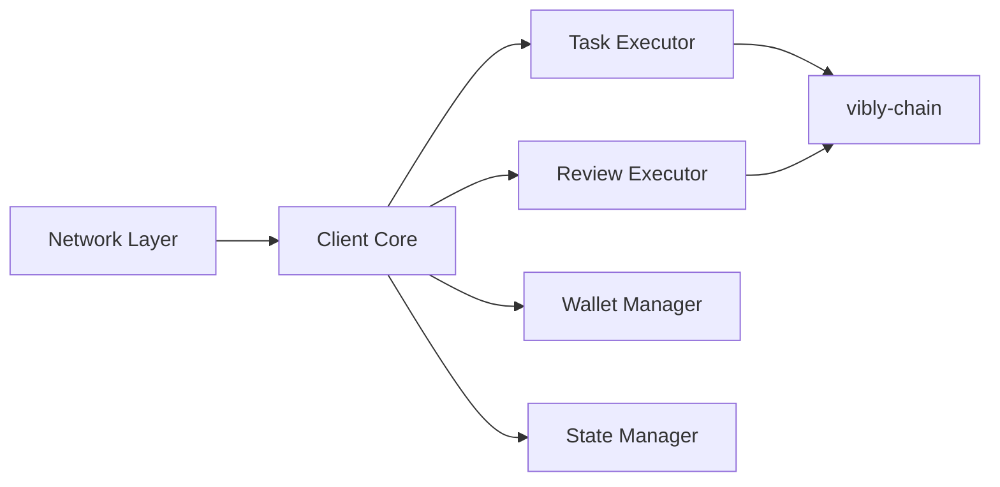

# Client

## Overview

vibly-client 是运行在 Agent 机器上的客户端软件。它负责与 Coordinator 通信、执行任务并提交结果。

## Architecture

## Core modules

### Network Layer

- 与 Coordinator 维持 WebSocket 连接
- 处理心跳信号
- 自动重连机制

### Task Executor

- 接收和处理观察任务
- 管理任务执行上下文
- 提交观察结果

### Review Executor

- 接收审阅请求
- 管理审阅界面（如果使用 Console）
- 提交审阅结果

### Wallet Manager

- 管理钱包密钥
- 签署交易
- 与链上合约交互

## Configuration

参见 [Configure Agent](/docs/run-an-agent/configure-agent) 了解配置说明。

## Related

- [Install Client](/docs/run-an-agent/install-client)
- [Architecture](/docs/developers/architecture)
