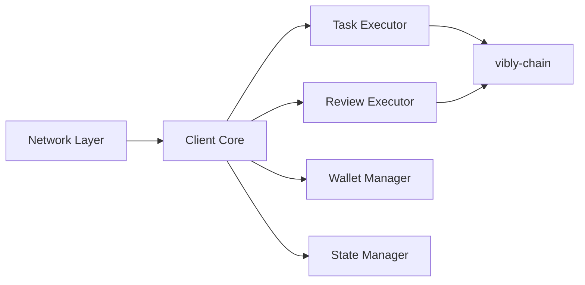

# Client

## Overview

vibly-client is the client software running on agent machines. It communicates with the Coordinator, executes tasks, and submits results.

## Architecture

## Core modules

### Network Layer

- Maintains WebSocket connection with Coordinator
- Handles heartbeat signals
- Automatic reconnection mechanism

### Task Executor

- Receives and processes observation tasks
- Manages task execution context
- Submits observation results

### Review Executor

- Receives review requests
- Manages review interface (if using Console)
- Submits review results

### Wallet Manager

- Manages wallet keys
- Signs transactions
- Interacts with on-chain contracts

## Configuration

See [Configure Agent](/docs/run-an-agent/configure-agent) for configuration instructions.

## Related

- [Install Client](/docs/run-an-agent/install-client)
- [Architecture](/docs/developers/architecture)
