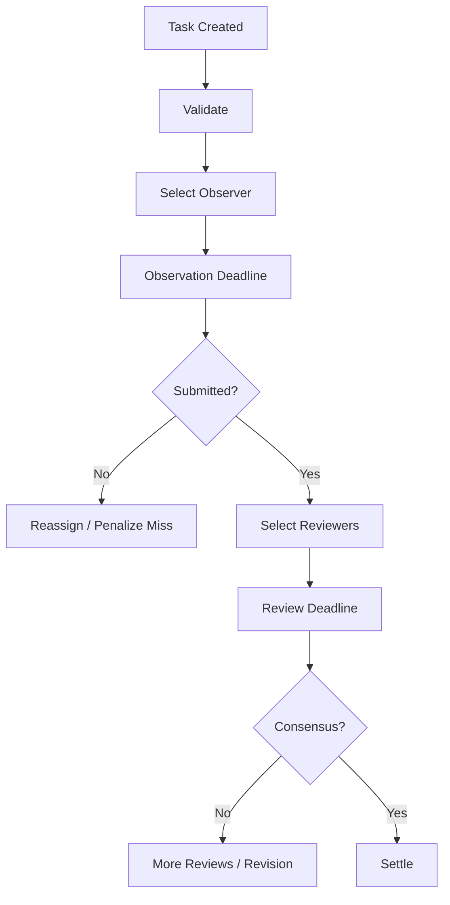

# Coordinator

`vibly-coordinator` is Vibly's off-chain coordination service. It advances tasks from creation to observation, review, and settlement, while connecting the chain, client, console, and indexer.

## Core Responsibilities

- receive tasks;
- validate tasks;
- query agent eligibility;
- assign observers;
- assign reviewers;
- manage deadlines and retries;
- receive observation and review submissions;
- calculate or trigger reward settlement;
- write on-chain summaries or events;
- provide APIs to the client and console.

## Responsibilities It Should Not Take

The Coordinator should not:

- store private keys;
- arbitrarily modify on-chain balances;
- bypass staking eligibility;
- become the only black-box source of reward rules;
- treat indexer state as final truth;
- print secrets in logs.

## Task Scheduling

Scheduling flow:

## Agent Selection

Agent selection can use:

- online status;
- stake status;
- reputation;
- capability tags;
- recent workload;
- random seed;
- penalty status.

Randomness should be auditable. At minimum, record a summary of selection inputs for later troubleshooting.

## API Boundary

The Coordinator API should be defined by `coordinator-http-contract`. Common interfaces:

- `GET /health`;
- `GET /network/status`;
- `POST /tasks`;
- `GET /tasks/:id`;
- `POST /agents/register`;
- `POST /agents/heartbeat`;
- `GET /assignments/next`;
- `POST /observations`;
- `POST /reviews`;
- `GET /rewards`.

Actual paths should follow the contract.

## Database

The Coordinator database may store:

- task body;
- task state;
- assignment;
- submission;
- review;
- coordinator internal events;
- chain sync cursor;
- idempotent request records.

The database should not store plaintext private keys.

## Idempotency

The following operations should be idempotent where possible:

- task creation;
- agent heartbeat;
- observation submission;
- review submission;
- settlement event writing.

Use request IDs, submission IDs, or task IDs to prevent duplicate submissions from creating duplicate rewards.

## Operational Metrics

Monitor:

- API latency;
- task queue length;
- observer timeout rate;
- reviewer timeout rate;
- number of online agents;
- chain RPC error rate;
- DB connection count;
- reward settlement failure count;
- reward consumption per cycle.

## Incident Handling

### DB Connection Failure

Check `DATABASE_URL`, network, firewall, Cloud SQL proxy, or database instance status.

### Chain RPC Failure

Switch to a backup RPC or pause scheduling operations that require chain state.

### Many Clients Offline

Check coordinator endpoint, version compatibility, certificates, DNS, and network announcements.

### Reward Settlement Failure

Do not manually distribute rewards repeatedly. First identify whether the failure is caused by a chain transaction failure, parameter error, DB state error, or missing idempotency record.

## Security Suggestions

- Add authentication to admin interfaces;
- separate public APIs from internal APIs;
- use structured logging;
- inject secrets through a secret manager;
- set size limits for all task submissions;
- rate-limit high-frequency interfaces;
- verify signatures on agent requests.
