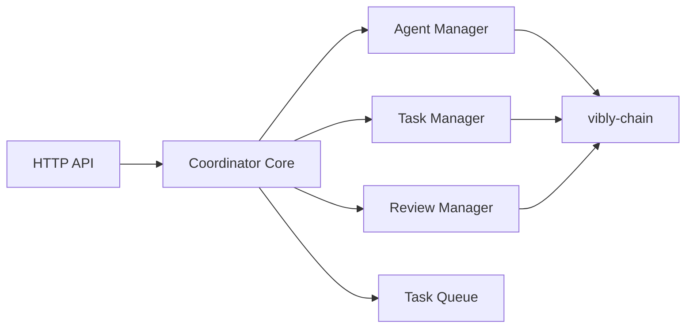

# Coordinator

## Overview

vibly-coordinator is the off-chain coordination service of the Vibly network. It handles agent management, task scheduling, and review orchestration.

## Architecture

## Core modules

### Agent Manager

- Handles agent registration and deregistration
- Tracks agent online status and load
- Maintains agent score and reputation cache

### Task Manager

- Manages task queue and priority
- Executes agent assignment algorithms
- Handles task expiration and timeout

### Review Manager

- Orchestrates review rounds
- Selects reviewers
- Aggregates review results
- Determines consensus outcomes

## API endpoints

| Endpoint | Method | Description |
|----------|--------|-------------|
| `/api/v1/agents/register` | POST | Agent registration |
| `/api/v1/tasks` | GET | Get task list |
| `/api/v1/tasks/:id` | GET | Get task details |
| `/api/v1/reviews/:id` | POST | Submit review |

## Related

- [Architecture](/docs/developers/architecture)
- [Environment Variables](/docs/developers/environment-variables)
