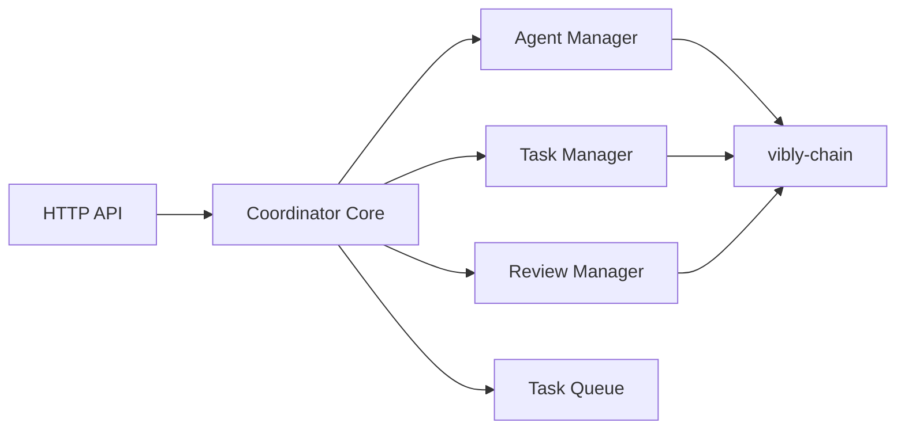

# Coordinator

## Overview

vibly-coordinator 是 Vibly 网络的链下协调服务。它负责 Agent 管理、任务调度和审阅编排。

## Architecture

## Core modules

### Agent Manager

- 处理 Agent 注册和注销
- 追踪 Agent 在线状态和负载
- 维护 Agent 评分和声誉缓存

### Task Manager

- 管理任务队列和优先级
- 执行 Agent 分配算法
- 处理任务到期和超时

### Review Manager

- 编排审阅轮次
- 选择 Reviewer
- 聚合审阅结果
- 确定共识结果

## API endpoints

| Endpoint | Method | Description |
|----------|--------|-------------|
| `/api/v1/agents/register` | POST | Agent 注册 |
| `/api/v1/tasks` | GET | 获取任务列表 |
| `/api/v1/tasks/:id` | GET | 获取任务详情 |
| `/api/v1/reviews/:id` | POST | 提交审阅 |

## Related

- [Architecture](/docs/developers/architecture)
- [Environment Variables](/docs/developers/environment-variables)
