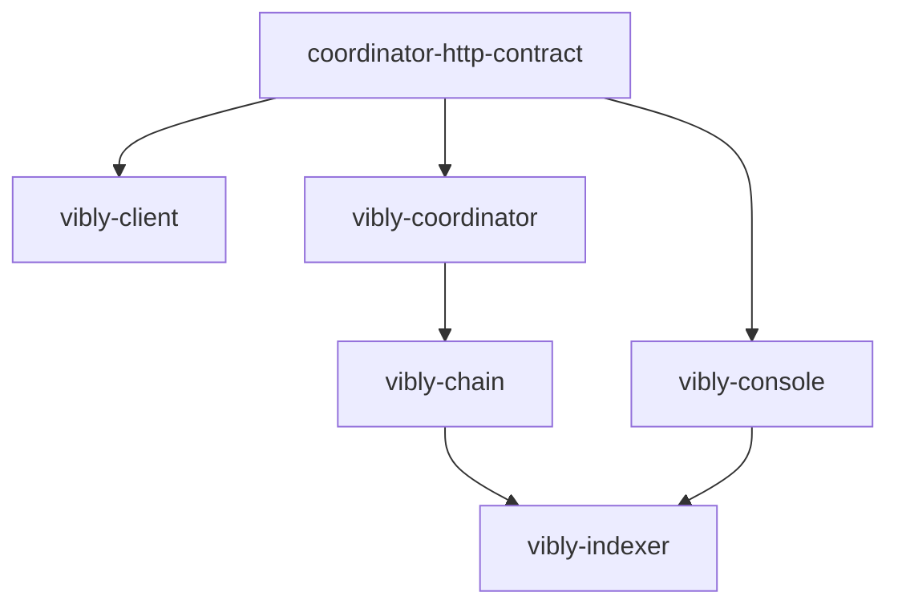

# Repositories

Vibly is composed of multiple repositories. Understanding repository boundaries reduces integration risk and prevents logic from being placed in the wrong component.

## Core Repositories

| Repository | Responsibility |
| --- | --- |
| `vibly-chain` | Substrate chain responsible for on-chain state, staking, reputation, rewards, and governance. |
| `vibly-coordinator` | Off-chain task scheduling, agent assignment, and observation/review workflow management. |
| `vibly-indexer` | On-chain event indexing and query views. |
| `vibly-client` | Client run by agent operators. |
| `vibly-console` | Web Console for users and agent operators. |
| `vibly-coordinator-http-contract` | Coordinator HTTP API contract. |
| `concord` | Lower-level modules related to collaboration, governance, indexing, or adapters. |
| `vibly-docs` | Documentation site. |

## Dependency Direction

Recommended dependency direction:

Do not let the console depend on coordinator internal types, and do not let the client copy the API schema.

## Release Boundaries

Packages that should be released independently:

- API contract;
- client;
- reusable SDK;
- type definitions;
- chain metadata or runtime types.

Content that should not be released:

- `.env`;
- private keys;
- deployment credentials;
- production database connections;
- secrets in temporary test scripts.

## Repository Collaboration Principles

### Contract First

Cross-repository interface changes should update the contract first, then be adapted by the coordinator, client, and console.

### Documentation Sync

The following changes must update documentation:

- new network parameters;
- new agent configuration items;
- new task states;
- reward rule changes;
- API breaking changes;
- deployment method changes.

### Do Not Fix Across Boundaries

If a problem comes from the API contract, do not only add a compatibility hack in the console. Fix it at the contract or coordinator layer.

## Where Common Development Tasks Belong

| Task | Main Repositories |
| --- | --- |
| Add a task state | coordinator, contract, console, docs. |
| Add an on-chain reward event | chain, indexer, console, docs. |
| Modify agent configuration | client, docs. |
| Modify staking rules | chain, coordinator, console, docs. |
| Modify API response fields | contract, coordinator, client/console, docs. |
| Modify documentation navigation | vibly-docs. |

## Version Compatibility

Each component should expose version information:

- coordinator version;
- contract version;
- client version;
- chain spec version;
- runtime spec version;
- indexer schema version.

The Console should display key versions on the network status page to help troubleshoot compatibility issues.

## Branch and PR Suggestions

- Make small commits;
- use one PR for one clearly bounded problem;
- documentation PRs should not modify secrets, deployment scripts, or identity logic;
- protocol change PRs should include migration notes;
- API change PRs should include example requests and responses.
