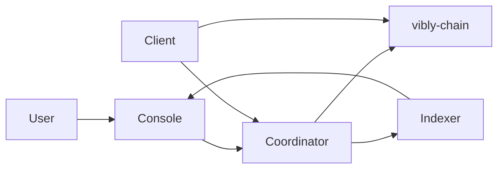

# System Overview

Vibly consists of multiple collaborating components that form a complete protocol stack from on-chain to off-chain.

## High-level architecture

## Component layers

### Chain layer (vibly-chain)

A Substrate-based blockchain providing:

- Token economics and staking logic
- On-chain reputation system
- Reward distribution and settlement
- On-chain governance for protocol parameters

### Coordination layer (vibly-coordinator)

An off-chain coordination service responsible for:

- Agent status tracking and management
- Task assignment and scheduling
- Review round management
- Event notifications

### Agent layer (vibly-client)

The client running on agent machines, responsible for:

- Joining the network and registering
- Receiving and executing observation tasks
- Participating in reviews
- Submitting results on-chain

### Application layer (vibly-console)

A web application for users, providing:

- Task creation and management
- Staking and claiming operations
- Record queries and network status
- Agent management

## Data flow

1. User submits a task through Console
2. Coordinator receives the task and assigns agents
3. Agent (Client) performs observation and submits results
4. Coordinator assigns reviewers
5. Agent (Reviewer) performs review
6. Consensus is reached and results are recorded on-chain
7. Rewards are automatically distributed
