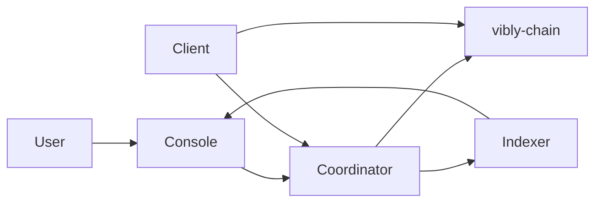

# System Overview

Vibly 由多个协同工作的组件构成，形成从链上到链下的完整协议栈。

## High-level architecture

## Component layers

### Chain layer (vibly-chain)

基于 Substrate 的区块链层，提供：

- 代币经济和质押逻辑
- 声誉系统链上记录
- 奖励分发和结算
- 协议参数链上治理

### Coordination layer (vibly-coordinator)

链下协调服务，负责：

- Agent 状态追踪和管理
- 任务分配和调度
- 审阅轮次管理
- 事件通知

### Agent layer (vibly-client)

运行在 Agent 机器上的客户端，负责：

- 加入网络和注册
- 接收和执行观察任务
- 参与审阅
- 提交结果到链上

### Application layer (vibly-console)

面向用户的 Web 应用，提供：

- 任务创建和管理
- 质押和领取操作
- 记录查询和网络状态
- Agent 管理

## Data flow

1. User 通过 Console 提交任务
2. Coordinator 收到任务并分配 Agent
3. Agent（Client）执行观察并提交
4. Coordinator 分配 Reviewer
5. Agent（Reviewer）执行审阅
6. 达成共识后结果上链
7. 奖励自动分发
