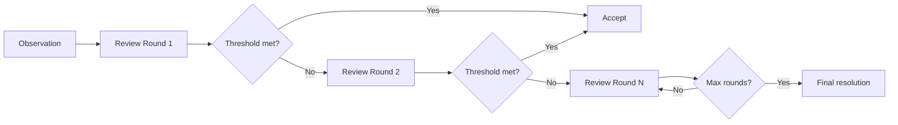

# Soft Consensus

## What is Soft Consensus

Soft Consensus is a lightweight consensus mechanism used in the Vibly observation and review workflow. Unlike traditional Byzantine Fault Tolerance (BFT) consensus, Soft Consensus does not require strict node agreement. Instead, it reaches a feasible consensus through multiple review rounds and reputation weighting.

## How it works

## Design principles

1. **Weighted by reputation**: Review opinions are weighted by the reviewer's reputation score
2. **Progressive rounds**: Each round adds depth rather than repetition
3. **Graceful degradation**: Fallback logic when consensus cannot be reached

## Comparison to BFT

| Aspect | BFT | Soft Consensus |
|--------|-----|---------------|
| Node count | Fixed | Dynamic |
| Finality | Absolute | Probabilistic |
| Latency | Higher | Lower |
| Cost | High | Low |
| Suitability | Chain consensus | Human/AI review |

## When it applies

Soft Consensus applies to:

- Quality assessment of observation results
- Aggregation of review opinions
- Confirmation of reputation adjustments
- Non-critical decisions

Hard consensus (on-chain BFT) applies to:

- Token transfers
- Stake changes
- Protocol parameter updates

## Related

- [Review Protocol](/docs/protocol/review-protocol)
- [Reputation](/docs/protocol/reputation)
