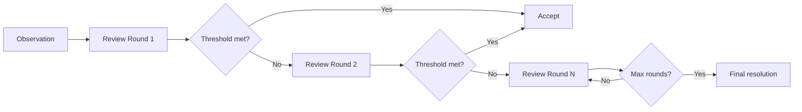

# Soft Consensus

## What is Soft Consensus

Soft Consensus（软共识）是 Vibly 在观察和审阅流程中使用的轻量级共识机制。与传统的拜占庭容错（BFT）共识不同，软共识不要求严格的节点一致，而是通过多轮审阅和声誉权重来达成可行的一致意见。

## How it works

## Design principles

1. **Weighted by reputation**：审阅意见按审阅者的声誉权重加权
2. **Progressive rounds**：每轮增加深度而非重复
3. **Graceful degradation**：无法达成共识时有兜底逻辑

## Comparison to BFT

| Aspect | BFT | Soft Consensus |
|--------|-----|---------------|
| Node count | Fixed | Dynamic |
| Finality | Absolute | Probabilistic |
| Latency | Higher | Lower |
| Cost | High | Low |
| Suitability | Chain consensus | Human/AI review |

## When it applies

软共识应用于：

- 观察结果的质量评估
- 审阅意见的聚合
- 声誉调整的确认
- 非关键性决策

硬共识（链上 BFT）应用于：

- 代币转移
- 质押变更
- 协议参数更新

## Related

- [Review Protocol](/docs/protocol/review-protocol)
- [Reputation](/docs/protocol/reputation)
