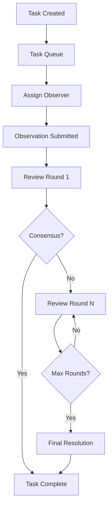

# Task Lifecycle

## Overview

任务（Task）是 Vibly 网络的工作单元。每个任务从创建到完成经历以下阶段。

## Lifecycle diagram



## Stages

### 1. Task creation

User 通过 Console 提交任务。任务包含：

- 任务描述和要求
- 奖励预算
- 所需观察者数量
- 截止时间

### 2. Task queuing

任务进入队列，Coordinator 根据 Agent 状态和任务要求分配 Observer。

### 3. Observation

被分配的 Observer 在规定时间内执行观察并提交结果。

### 4. Review

观察结果进入审阅流程。每轮随机选取 Reviewer 进行 peer review。

### 5. Completion

达成共识后任务完成：

- 结果返回给 User
- 奖励自动分发
- 声誉记录更新

## Timeline

```
Task Created ────┬──→ Observation Window ──┬──→ Review Rounds ──→ Complete
                 │                         │
            T=0  │                    T=deadline
```

## Related

- [Observation Protocol](/docs/protocol/observation-protocol)
- [Review Protocol](/docs/protocol/review-protocol)
- [Incentives](/docs/protocol/incentives)
