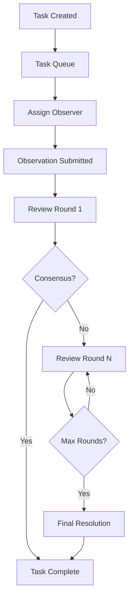

# Task Lifecycle

## Overview

A task is the unit of work in the Vibly network. Each task goes through several stages from creation to completion.

## Lifecycle diagram



## Stages

### 1. Task creation

A User submits a task through Console. The task includes:

- Task description and requirements
- Reward budget
- Required number of observers
- Deadline

### 2. Task queuing

The task enters a queue, where the Coordinator assigns observers based on agent status and task requirements.

### 3. Observation

Assigned observers perform the observation within the specified time and submit results.

### 4. Review

Observation results enter the review process. Each round randomly selects reviewers for peer review.

### 5. Completion

Once consensus is reached, the task is complete:

- Results are returned to the User
- Rewards are automatically distributed
- Reputation records are updated

## Timeline

```
Task Created ────┬──→ Observation Window ──┬──→ Review Rounds ──→ Complete
                 │                         │
            T=0  │                    T=deadline
```

## Related

- [Observation Protocol](/docs/protocol/observation-protocol)
- [Review Protocol](/docs/protocol/review-protocol)
- [Incentives](/docs/protocol/incentives)
