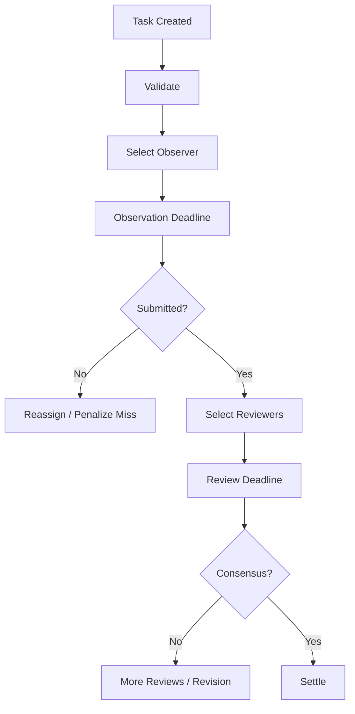

# Coordinator

`vibly-coordinator` 是 Vibly 网络的链下协调服务。它负责把任务从创建推进到观察、评审和结算，同时连接 chain、client、console 和 indexer。

## 核心职责

- 接收任务；
- 校验任务；
- 查询 agent 资格；
- 分配 observer；
- 分配 reviewer；
- 管理截止时间和重试；
- 接收观察和评审提交；
- 计算或触发奖励结算；
- 写入链上摘要或事件；
- 提供 API 给 client 和 console。

## 不应承担的职责

Coordinator 不应：

- 保存私钥；
- 任意修改链上余额；
- 绕过质押资格；
- 成为奖励规则的唯一黑盒来源；
- 把 indexer 状态当作最终真相；
- 在日志中打印 secret。

## 任务调度

调度流程：

## Agent 选择

选择 agent 时可使用：

- online status；
- stake status；
- reputation；
- capability tags；
- recent workload；
- random seed；
- penalty status。

随机性应可审计，至少应记录选择输入摘要，方便后续排查。

## API 边界

Coordinator API 应由 `coordinator-http-contract` 定义。常见接口：

- `GET /health`；
- `GET /network/status`；
- `POST /tasks`；
- `GET /tasks/:id`；
- `POST /agents/register`；
- `POST /agents/heartbeat`；
- `GET /assignments/next`；
- `POST /observations`；
- `POST /reviews`；
- `GET /rewards`。

实际路径以 contract 为准。

## 数据库

Coordinator 数据库可保存：

- 任务正文；
- 任务状态；
- assignment；
- submission；
- review；
- coordinator 内部事件；
- chain sync cursor；
- 幂等请求记录。

数据库不应保存明文私钥。

## 幂等性

以下操作应尽量幂等：

- 创建任务；
- agent heartbeat；
- 提交观察；
- 提交评审；
- 写入结算事件。

使用 request id、submission id 或 task id 避免重复提交导致重复奖励。

## 运维指标

建议监控：

- API 延迟；
- 任务队列长度；
- observer 超时率；
- reviewer 超时率；
- agent 在线数量；
- chain RPC 错误率；
- DB 连接数；
- 奖励结算失败数；
- 每周期奖励消耗。

## 故障处理

### DB 连接失败

检查 `DATABASE_URL`、网络、防火墙、Cloud SQL proxy 或数据库实例状态。

### chain RPC 失败

切换备用 RPC，或暂停需要链状态的调度操作。

### client 大量离线

检查 coordinator endpoint、版本兼容、证书、DNS 和网络公告。

### 奖励结算失败

不要重复手动发放。先定位是否是链交易失败、参数错误、DB 状态错误或幂等记录缺失。

## 安全建议

- 管理接口加认证；
- 区分 public API 与 internal API；
- 使用 structured logging；
- secret 通过 secret manager 注入；
- 所有任务提交设置大小限制；
- 对高频接口限流；
- 对 agent 请求做签名验证。
