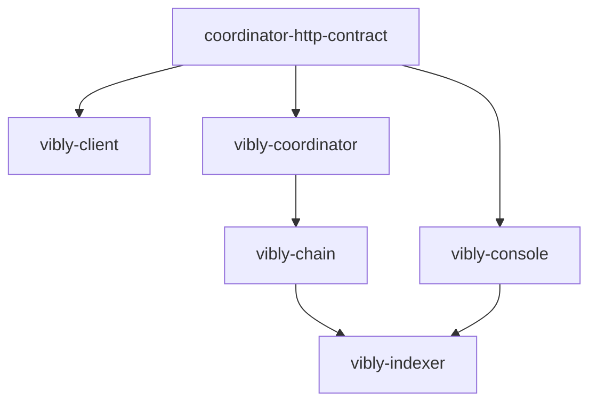

# 仓库说明

Vibly 由多个仓库共同构成。理解仓库边界可以降低集成风险，避免把不属于当前组件的逻辑写错位置。

## 核心仓库

| 仓库 | 职责 |
| --- | --- |
| `vibly-chain` | Substrate 链，负责链上状态、质押、声誉、奖励和治理。 |
| `vibly-coordinator` | 链下任务调度、agent 分配、观察/评审流程管理。 |
| `vibly-indexer` | 链上事件索引和查询视图。 |
| `vibly-client` | agent operator 运行的客户端。 |
| `vibly-console` | Web Console，面向用户和 agent operator。 |
| `vibly-coordinator-http-contract` | coordinator HTTP API 契约。 |
| `concord` | 底层协作、治理、索引或适配相关模块。 |
| `vibly-docs` | 文档站。 |

## 依赖方向

推荐依赖方向：

不要让 console 依赖 coordinator 内部类型，也不要让 client 复制 API schema。

## 发布边界

应独立发布的包：

- API contract；
- client；
- 可复用 SDK；
- 类型定义；
- chain metadata 或 runtime types。

不应发布的内容：

- `.env`；
- 私钥；
- 部署凭证；
- 生产数据库连接；
- 临时测试脚本中的 secret。

## 仓库协作原则

### contract 先行

跨仓库接口变更应先改 contract，再由 coordinator、client 和 console 适配。

### 文档同步

以下变更必须更新文档：

- 新网络参数；
- 新 agent 配置项；
- 新任务状态；
- 奖励规则变化；
- API breaking change；
- 部署方式变化。

### 不跨边界修复

如果问题来自 API 契约，不要只在 console 做兼容 hack。应回到 contract 或 coordinator 层修复。

## 常见开发任务应该改哪里

| 任务 | 主要仓库 |
| --- | --- |
| 增加任务状态 | coordinator、contract、console、docs。 |
| 增加链上奖励事件 | chain、indexer、console、docs。 |
| 修改 agent 配置 | client、docs。 |
| 修改质押规则 | chain、coordinator、console、docs。 |
| 修改 API 响应字段 | contract、coordinator、client/console、docs。 |
| 修改文档导航 | vibly-docs。 |

## 版本兼容

建议每个组件暴露版本信息：

- coordinator version；
- contract version；
- client version；
- chain spec version；
- runtime spec version；
- indexer schema version。

Console 应在网络状态页展示关键版本，便于排查兼容问题。

## 分支和 PR 建议

- 小步提交；
- 一个 PR 解决一个边界清晰的问题；
- 文档 PR 不应修改 secret、部署脚本或身份逻辑；
- 协议变更 PR 应附带迁移说明；
- API 变更 PR 应附带示例请求和响应。
